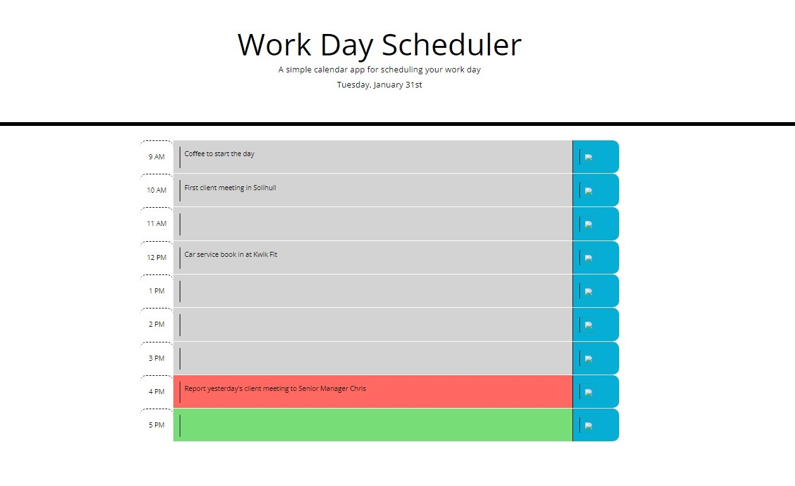
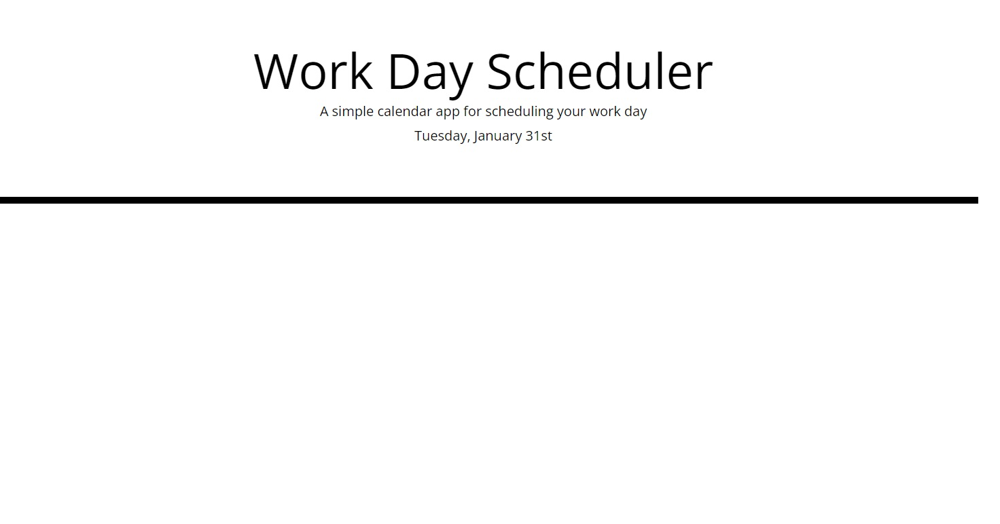
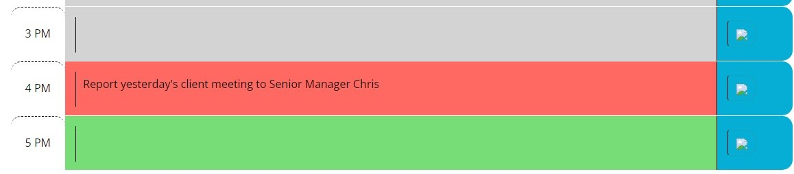

# Work_Day_Planner
In this application a days page is created to help a person plan out their working day. The plan consists of hourly rows from 9am to 5pm. Each row is split into three sections with first carrying the time label, the second is for the person to enter activities and the final section contain a button. The entered data is saved to local storage only when the row button is clicked. The scheduler page is shown below:

## Planner Heading
The planner has a heading with a brief description followed by a formatted date. The date is the current system date which is formated using the moment application. The heading is illustrated in the attached image below:

## Planner Rows
As mentioned early, the activities for each hour are captured in a row with three columns. The columns are organised using bootstrap. The largest of the three rows is reserved for the user entries. The first column displays the time and the last column is used to save the user entries. An image of a row is included below:

## Colour Coding
The planner rows are coded in three colours to for activities that are in the past, present or future. The rows containing the activities in the past are coloured light grey. The present activity is coloured in red and future activities are coloured green. The planner tracks time by the changing of row colours. A snapshot is given below:

## Data Storage
All data entries are stored locally with each new entry added to the existing data. The data storage is organised in an array. The data is converted into a string before storage. The stored data can be identified by the key 'Planner' as illustrated below.

## Application
Click the link below to view the application.
https://amoham1811.github.io/Work_Day_Planner/